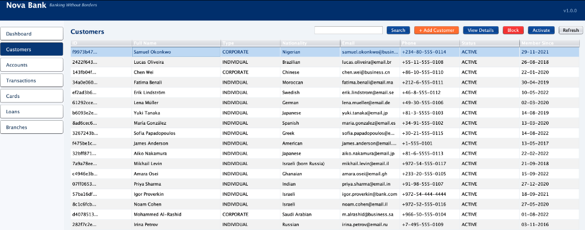

# 🏦 Nova Bank — Legacy Java 8 Banking System

> **A fully functional Java 8 Swing desktop banking application built as a baseline for Java modernization exercises.**



---

## Overview

**Nova Bank** is a desktop banking system written in **Java 8** using **Swing** for the UI layer. It simulates a real-world retail banking application with customer management, multi-currency accounts, cards, loans, and transaction processing.

This project serves as a **modernization baseline** — a deliberately "legacy" codebase that can be migrated to modern Java (17/21), Spring Boot, containerized architectures, or cloud-native stacks as a hands-on learning exercise.

---

## Features

| Module | Capabilities |
|---|---|
| **Dashboard** | Real-time stats: total customers, accounts, balance, recent transactions |
| **Customers** | Register, search, view details, block/activate. Double-click for profile |
| **Accounts** | Open checking, savings, investment, business accounts. Freeze/unfreeze/close |
| **Transactions** | Deposit, withdraw, transfer between accounts with full audit trail |
| **Cards** | Issue debit/credit cards (Visa, Mastercard, Amex). Block/unblock |
| **Loans** | Apply for personal, mortgage, auto, business loans. Make repayments |
| **Branches** | View all bank branch locations and contact details |

### Additional Highlights

- **18 pre-seeded customers** with realistic international profiles, accounts, and transaction histories
- **Multi-currency support** — USD, EUR, ILS, JPY, BRL, GHS, SEK, and more
- **Israel timezone (Asia/Jerusalem)** — all dates and timestamps displayed as `dd-MM-yyyy HH:mm:ss`
- **Empty-by-default pattern** — panels load data only after explicit customer selection
- **Bank Nova Bank-inspired color palette** — navy blue, white, and orange professional theme

---

## Technology Stack

| Layer | Technology |
|---|---|
| Language | Java 8 (JDK 1.8) |
| UI Framework | Java Swing |
| Build Tool | Apache Maven 3.6+ |
| Architecture | MVC (Model–View–Controller) |
| Data Storage | In-memory (no database) |
| Timezone | Asia/Jerusalem |

---

## Project Structure

```
bank-java-modernization/
├── pom.xml                          # Maven build configuration
├── docs/                            # Documentation and screenshots
│   └── screenshot-customers.png
└── src/main/java/com/bank/
    ├── BankApplication.java         # Entry point
    ├── config/
    │   └── BankConfig.java          # Bank branding and constants
    ├── data/
    │   └── DataSeeder.java          # Pre-populated sample data (18 customers)
    ├── exception/                   # Custom business exceptions
    ├── model/                       # Domain models
    │   ├── Customer.java
    │   ├── Account.java
    │   ├── Transaction.java
    │   ├── Card.java
    │   ├── Loan.java
    │   ├── Branch.java
    │   └── enums/                   # AccountType, CardType, LoanType, etc.
    ├── repository/                  # In-memory data repositories
    ├── service/                     # Business logic services
    ├── ui/                          # Swing UI layer
    │   ├── MainWindow.java          # Main frame, sidebar, theme colors
    │   └── panels/                  # Dashboard, Customers, Accounts, etc.
    └── util/
        └── DateUtil.java            # Centralized Israel timezone formatting
```

---

## Getting Started

### Prerequisites

- **Java 8+** (JDK 1.8 or higher)
- **Maven 3.6+**

### Build & Run

```bash
# Clone the repository
git clone https://github.com/igor-olikh/bank-java-modernization.git
cd bank-java-modernization

# Build the project
mvn clean package

# Run the application
java -jar target/bank-system.jar
```

The application window will open with the **Dashboard** showing aggregated statistics. Navigate using the sidebar on the left.

---

## Pre-Seeded Data

The system starts with **18 customers** from around the world, each with:

- Pre-opened bank accounts (checking, savings, investment, business)
- Issued debit/credit cards
- Transaction history (salary credits, payments, ATM withdrawals, fees)
- Active loans (personal, mortgage, auto)

Member-since dates are randomized between **3–10 years ago** for realism. Account opening dates are logically tied to each customer's join date.

### Branches

| Branch | Location |
|---|---|
| Main Headquarters | New York, USA |
| European HQ | London, UK |
| Asia Pacific Office | Singapore |
| Tel Aviv Branch | Tel Aviv, Israel |

---

## Modernization Roadmap

This codebase is intentionally built with Java 8 patterns to provide a realistic migration exercise. Potential modernization targets include:

| Area | Legacy (Current) | Modern Target |
|---|---|---|
| Java Version | Java 8 | Java 17 / 21 (Liberty) |
| UI Framework | Swing | Web UI (React, Angular, or Vaadin) |
| Backend | Monolithic JAR | Spring Boot microservices |
| Data Storage | In-memory collections | JPA + PostgreSQL / MongoDB |
| Build | Maven JAR plugin | Docker containerization |
| Deployment | Desktop JAR | Kubernetes / Cloud Run |
| API Layer | None | REST API (OpenAPI 3.0) |
| Testing | None | JUnit 5 + Mockito |

---

## License

This project is intended for educational and demonstration purposes.

---

## Contact

For questions or contributions, please open an issue on [GitHub](https://github.com/igor-olikh/bank-java-modernization).
