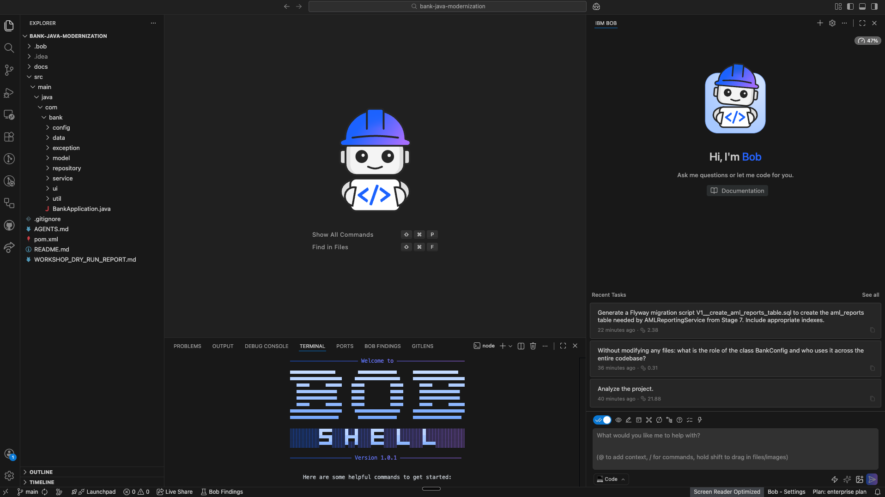
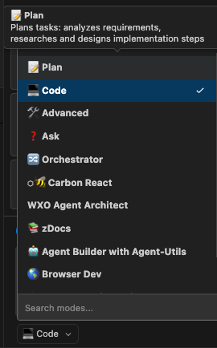
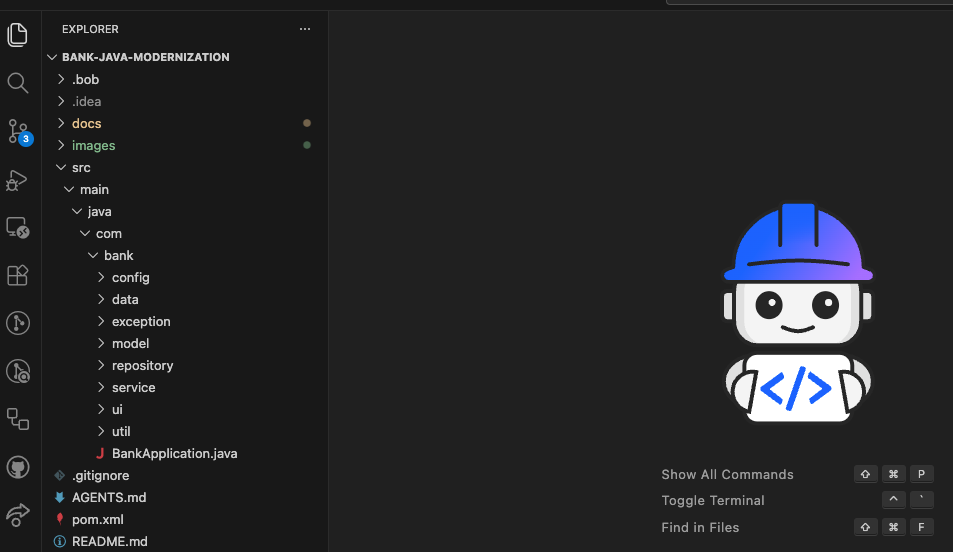
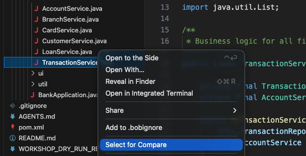
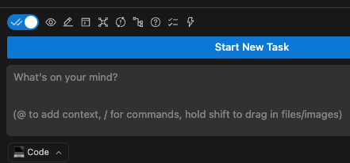

# סדנת IBM Bob לעולם Java — מדריך למשתתף

## ברוכים הבאים

סדנה זו תעזור לכם להכיר את **IBM Bob** — כלי בינה מלאכותית המסייע למפתחי Java להבין קוד legacy לא מוכר, לתכנן מיגרציה מ-Java 8 ל-Java 21 ולממש אותה בצורה מבוקרת.

### מה תלמדו

- לנתח אפליקציית Java לא מוכרת על Java 8 (סגנון legacy)
- לבקש מ-IBM Bob המלצות למודרניזציה ל-Java 21 ונימוקים (מה לשנות, למה, ואילו פיצ'רים של Java 21 להשתמש)
- לבצע שינויים בקוד בצורה מבוקרת
- להבין אפליקציות רב-שכבתיות (Swing UI + Service + Repository + Domain)
- לייצר תיעוד, תרשימי זרימה וקונפיגורציות בנייה (Maven `pom.xml`, יוניט-טסטים)
- לאתגר ולאמת תשובות של IBM Bob

### משך הסדנה

כ-**3 שעות** (החלק המעשי, לאחר מפגש פתיחה והדגמה).

---

## חלק ראשון: הכנה

### צ'קליסט לפני תחילת הסדנה

- **IBM Bob IDE** מותקן ופועל על המחשב שלכם
- מותקנים **JDK 8** וגם **JDK 21** (תזדקקו לשניהם: JDK 8 להרצת גרסת ה-legacy, JDK 21 לאחר המודרניזציה); בדקו עם `java -version`
- מותקן **Maven 3.6+** (`mvn -v`)
- מותקן **Git client**
- יש גישה לאינטרנט
- הכינו תיקייה ריקה (`C:\JavaBob\` ב-Windows, או `~/JavaBob/` ב-Mac)

### הכרת סביבת IBM Bob IDE

**חלונות עיקריים:**

- **Explorer** — סייר הקבצים (משמאל)
- **Editor** — עורך הקוד (מרכז)
- **Chat** — הצ'אט עם IBM Bob
- **Terminal** — שורת פקודה

**מצבים:**

IBM Bob עובד בשני מצבים:

| מצב | התנהגות | מתי משתמשים |
|---|---|---|
| **PLAN / ASK** | מייעץ, מסביר, ממליץ — לא משנה קבצים | שלבים 1–5 |
| **CODE** | משנה קבצים, מריץ פקודות בפועל | שלב 6 והלאה |

המצב מוצג בפינה התחתונה של ה-IDE. חשוב לבדוק לפני כל שלב.

---

## חלק שני: עבודה מעשית

> **חשוב:** שלבים 1–7 מבוצעים **בצ'אט משותף אחד** עם IBM Bob. אל תפתחו צ'אט חדש בין השלבים האלה — IBM Bob זוכר את ההקשר בתוך שיחה אחת, והרבה פרומפטים בשלבים 4–7 מסתמכים על מה שנדון קודם. צ'אט חדש נפתח באופן מפורש רק החל משלב 8 (שם השלב עצמו אומר "פתח צ'אט חדש").

## שלב 1 — שלב מקדים: הורדת הפרויקט

### מטרה

להכיר את סביבת העבודה של IBM Bob דרך משימה מעשית — הורדת פרויקט **`bank-java-modernization`**.

### התהליך המלא

**א. הדביקו בצ'אט של IBM Bob:**

> Download the project from https://github.com/igor-olikh/bank-java-modernization and load it into IBM Bob.

**ב. IBM Bob יציג תוכנית** וכנראה ימליץ להשתמש ב-`git client`.

**ג. הנחו את IBM Bob לבצע הורדה ישירה של ZIP** לתיקייה שהכנתם:

> I prefer a direct download of a ZIP file from the site into the folder `C:\JavaBob\` (or `~/JavaBob/` if you are on Mac).

**ד. פתחו את הפרויקט ב-IDE:**

1. בתפריט: **File → Open Folder**
2. בחרו בתיקיית `bank-java-modernization` שיצרתם
3. אשרו את הפתיחה

### תוצאות צפויות

- עותק מקומי של הפרויקט על המחשב שלכם
- היכרות עם החלונות העיקריים של ה-IDE
- הבנה ראשונית ש-IBM Bob מספק אוטומציה למשימות סביב הקוד, לא רק לקוד עצמו

> **שימו לב:** להורדת הפרויקט IBM Bob יעבור לרגע למצב **CODE** (כי נדרש לכתוב קבצים לדיסק) — אשרו את המעבר. זה לא המוקד של השלב, נחזור לזה בהרחבה בשלב 6. לפני המעבר לשלב 2, ודאו שחזרתם למצב **PLAN/ASK**.

> **טיפ:** אם IBM Bob לא עושה כלום — כנראה שהוא מחכה לתשובה מכם. בדקו את הצ'אט.

> **בונוס (אופציונלי):** לאחר פתיחת הפרויקט, בקשו מ-IBM Bob:
>
> > Build the project with Maven and confirm that the build succeeds.
>
> IBM Bob יעבור למצב **CODE**, יריץ `mvn clean package` ויראה את התוצאה. זה מאשר מיד שה-JDK ו-Maven מוגדרים כראוי. לאחר מכן, אל תשכחו לחזור למצב **PLAN/ASK**.

---

## שלב 2 — ניתוח

### מטרה

להבין מה האפליקציה עושה, אילו מודולים קיימים ואיך הכל מתחבר — מבלי לפתוח קובץ Java אחד.

### שלב 2.1 — ניתוח כללי

**הדביקו ב-IBM Bob:**

> Analyze the project.

> **אם IBM Bob ישאל שאלת הבהרה** (לדוגמה, "על אילו היבטים להתמקד?") עם אפשרויות מוצעות — בחרו את האפשרות הכי כללית ("All aspects", "General overview"), או כתבו במילים שלכם: `All aspects — give me a comprehensive overview`. זה תקף גם לשלבים אחרים — IBM Bob שואל מדי פעם שאלות הבהרה לפני התשובה.

IBM Bob יכין מסמך ניתוח עם הסבר על האפליקציה.

**לאחר מכן, העמיקו עם הפרומפט הבא:**

> Explain the application at a high level, including business goals, core functions, interfaces, and the system architecture.

### מה אתם אמורים לקבל

- סיכום מנהלים של האפליקציה
- מטרות עסקיות (ניהול לקוחות, חשבונות, העברות)
- פונקציות מרכזיות
- ארכיטקטורה (Java 8, Swing, Maven, in-memory repositories, MVC pattern)
- מפת השירותים והשכבות הראשיים (`service/`, `repository/`, `model/`, `ui/`)

> **טיפ מעשי:** מומלץ לבקש מ-IBM Bob לשמור את הניתוח לקובץ, כדי שתוכלו לחזור אליו בהמשך:
>
> > Save the analysis to a file `ANALYSIS.md`.

### פתחו את הקובץ שנוצר — לחצו על אייקון **open preview**.

### שלב 2.2 — ניתוח של פעולה ספציפית (העברת כספים בין חשבונות)

**הדביקו ב-IBM Bob:**

> Explain the money transfer operation, including: which classes are involved, dependencies, data flow, exceptions, UI integration, and persistence.

### מה אתם אמורים לקבל

IBM Bob יספק ניתוח מפורט של פעולת **העברת הכספים**, שיכלול (בין היתר):

- זיהוי הפעולה — העברה בין שני חשבונות של אותו לקוח או לקוחות שונים
- המתודה הראשית — `TransactionService.transfer(fromAccountId, toAccountId, amount, description)`
- מסך ה-UI הקשור — `TransactionsPanel`
- רשימת השירותים שנקראים (`AccountService.getAccount`, `AccountService.saveAccount`, `TransactionRepository.save`)
- תלויות וממשקים — מודלים (`Account`, `Transaction`), repositories, exceptions (`InsufficientFundsException`, `AccountFrozenException`)
- תיאור הזרימה — מקליק UI דרך השירות אל ה-repository ובחזרה

> **תשובת IBM Bob עשויה להיות עשירה יותר או שונה מעט בכל הרצה.** זה טבעי לעבודה עם כלי AI. העיקר שהתשובה תכסה את הנושאים העיקריים.

---

## שלב 3 — בקשת שינוי לאפליקציה

### מטרה

לדמות מצב שבו בקשה עסקית חדשה מגיעה למפתח Java, ולראות איך IBM Bob מתרגם אותה להמלצות.

### רקע עסקי

דרישה רגולטורית חדשה — דיווח על כל העברת כספים בסכום מעל **9,000 ש"ח**, לצורך מניעת הלבנת הון (**AML**).

### הפרומפט

**הדביקו ב-IBM Bob:**

> Without modifying any files: what would need to change in order to report into an external file or external table every money transfer between accounts in an amount above 9,000 NIS? All relevant details of the operation must be reported (such as date, time, amount, source, destination, etc.). Just describe the recommended changes — do not edit or create any files.

### מה אתם אמורים לקבל

IBM Bob יספק:

- זיהוי המחלקה/מתודה הנכונה לשינוי: **`TransactionService.transfer(...)`** (קובץ `src/main/java/com/bank/service/TransactionService.java`)
- תיאור של השינוי הנדרש
- רשימת שדות לדיווח (תאריך, שעה, סכום, חשבונות, משתמש, טרמינל וכו')

> **שימו לב:** IBM Bob לפעמים נותן יותר ממה שביקשתם — אולי אפילו השוואה בין אפשרויות, אולי אפילו קוד. זה בסדר — הוא יסודי.

---

## שלב 4 — העמקת הבנה (נימוק ההמלצה)

### מטרה

לראות ש-IBM Bob יודע לנמק את המלצותיו על בסיס הקוד. זה הופך אותו לשותף לדיון, לא רק לכלי שמחזיר תשובות.

### רקע

בדומה ל-`TransactionService.transfer()`, גם המתודות `TransactionService.deposit()` ו-`TransactionService.withdraw()` עובדות עם חשבונות. אז למה השינוי במתודה אחת ולא באחרות? IBM Bob אמור להסביר שזה בגלל ש-`deposit()` ו-`withdraw()` מטפלות רק בחשבון בודד (זיכוי/חיוב), בעוד ש-`transfer()` מטפלת בהעברה בין שני חשבונות.

### הפרומפט

**הדביקו ב-IBM Bob:**

> Without modifying any files: explain why the change is needed in method `TransactionService.transfer()` and not in `TransactionService.deposit()` or `TransactionService.withdraw()`.

### מה אתם אמורים לקבל

| **`transfer()`** | **`deposit()` / `withdraw()`** |
|---|---|
| מטפלת בהעברה בין שני חשבונות | מטפלות בחשבון בודד (זיכוי או חיוב) |
| פרמטרים: `fromAccountId` ו-`toAccountId` (מקור + יעד) | פרמטר: `accountId` (חשבון בודד) |
| תואמת את הדרישה העסקית של AML | תואמות הפקדות/משיכות (לא דורשות דיווח AML) |

IBM Bob יראה את **חתימות המתודות** ואת **הגוף שלהן** כהוכחה (`public Transaction transfer(...)`, `public Transaction deposit(...)`, `public Transaction withdraw(...)`).

---

## שלב 5 — מידע תומך החלטה

### מטרה

לשפר את שיקול הדעת של מפתח ה-Java על ידי השוואת אפשרויות יישום לפני הקידוד.

### הפרומפט

**הדביקו ב-IBM Bob:**

> Without modifying any files: what is the preferred storage for AML reports — a relational database (JDBC/JPA), a NoSQL store (MongoDB), a structured file (CSV/JSON), or a message queue (Kafka)?

### מה אתם אמורים לקבל

- השוואה בין שימוש ב-**מסד נתונים יחסי (JDBC/JPA)**, **NoSQL (MongoDB)**, **קובץ מובנה (CSV/JSON)** ו-**תור הודעות (Kafka)**
- יתרונות וחסרונות של כל אפשרות
- המלצה מנומקת של IBM Bob — לעבוד עם **מסד נתונים יחסי (לדוגמה PostgreSQL דרך JPA/Hibernate)**, מכיוון שדרישות AML כוללות אודיט, טרנזקציות ACID ושאילתות SQL לבדיקות

> **טיפ:** אם IBM Bob כבר ענה על זה בשלב 3, אפשר לדלג או לשאול רק שאלה ספציפית (לדוגמה: "מה ההשפעה על ביצועים?").

---

## שלב 6 — מודרניזציה Java 8 → Java 21 (מצב `/java-modernization`)

### מטרה

להדגים את המצב המיוחד של IBM Bob למודרניזציית Java — `/java-modernization`. במצב זה, IBM Bob מנתח, מתכנן ומבצע באופן אוטומטי את המיגרציה מ-Java 8 ל-Java 21. **לא צריך לכתוב פרומפטים** — אתם רק סוקרים הצעות ומאשרים פעולות.

### רקע

במצבים הרגילים PLAN/ASK ו-CODE, שאלנו את IBM Bob שאלות והוראות באופן ידני. אך למודרניזציית Java, ל-IBM Bob יש מצב נפרד שאומן מראש — `/java-modernization`. זו הדרך הנכונה למודרן אפליקציית enterprise, וזה בדיוק מה שנראה.

### שלב 6.1 — הפעלת המצב

בצ'אט של IBM Bob:

1. הקלידו `/` — תופיע רשימה נפתחת של **Modes**
2. בחרו **`/java-modernization`** (תיאור: *Modernize Java applications*)
3. אינדיקטור המצב הפעיל בפינה השמאלית-תחתונה של הצ'אט יעבור ל-**Java Modernization**

לאחר ההפעלה, IBM Bob מוכן למודרניזציה. פרומפטים ארוכים כבר לא נדרשים — המצב כבר יודע מה לעשות.

### שלב 6.2 — הרצת המודרניזציה (שני שלבים)

IBM Bob מחלק את המודרניזציה באופן טבעי ל-**תכנון** ו-**ביצוע**. תחילה הוא מציג תוכנית ומבקש "אישור להתחיל" מפורש — זו שכבת בקרה נוספת לפני שינויים מסיביים.

#### שלב 6.2 (a) — בקשת התוכנית

הדביקו:

> Modernize this project from Java 8 to Java 21.

IBM Bob:

- ינתח את בסיס הקוד
- ייצור קובץ עם תוכנית מיגרציה (בדרך כלל `JAVA_21_MIGRATION_PLAN.md`)
- ייתכן שיעדכן מיד את `pom.xml` (source/target → 21)
- **יעצור** ויציג את התוכנית: מה לשנות, אילו פיצ'רים של Java 21 ליישם
- ימתין להחלטה שלכם "ליישם או לא"

#### שלב 6.2 (b) — הפעלת הביצוע

כשתראו את התוכנית ותרצו ליישם, הדביקו:

> Now execute the migration plan you produced. Apply all phases: convert models to Records, make BankException sealed, apply Virtual Threads, Pattern Matching, Text Blocks, and modernize repositories. Show me each diff before applying, and ask for approval on every file change.

IBM Bob יתחיל **ליישם שינויים**, צעד אחר צעד, ויבקש אישור על כל אחד.

### שלב 6.3 — אישורים (התפקיד הראשי שלכם)

זה הרגע המכריע: **המשימה שלכם היא לא להקליד, אלא לסקור ולאשר**.

IBM Bob יעצור מדי פעם ויבקש אישור. דיאלוגים טיפוסיים:

- *"לשנות את `pom.xml` (source/target 1.8 → 21)?"* → **APPROVE**
- *"להמיר את `Transaction.java` ל-record? (60 שורות → 8 שורות)"* → סקרו את ה-diff → **APPROVE**
- *"ליישם Virtual Threads ב-`TransactionService`?"* → **APPROVE**
- *"להחליף `if/else if` ב-pattern-matching `switch` ב-`TransactionMenu`?"* → **APPROVE**

> **טיפ:** אם תרצו לראות פרטים לפני כל אישור, בקשו מ-IBM Bob:
>
> > Always show me the exact diff before applying any change.

> **IBM Bob עשוי להציע אפשרויות עם trade-offs.** על חלק מהקבצים (לדוגמה, `Transaction.java`, שיש לו שדה mutable בשם `status`) IBM Bob יראה כמה דרכים סבירות ויציע בחירה — לדוגמה:
>
> - **Option A:** להשאיר כ-class, רק לעדכן syntax (var, switch) — בטוח יותר, ללא breaking changes
> - **Option B:** להמיר ל-record + להוסיף immutable wrapper — יותר אידיומים של Java 21, אך דורש שינויים במקומות תלויים
>
> IBM Bob בדרך כלל נותן את ההמלצה שלו (לעיתים האפשרות "הבטוחה"). בחרו את מה שמתאים לכם — שתי האפשרויות תקפות. אם תרצו להראות פיצ'רים של Java 21 במקסימום — בחרו באפשרות ה-"מתקדמת" יותר (record / sealed / pattern matching). אם תרצו סיכון מינימלי — בחרו את המומלץ.

### שלב 6.4 — השוואת לפני/אחרי

לאחר כל בלוק שינויים, השוו את המקור עם הגרסה המודרנית:

- בחלון ה-**Explorer** קליק ימני על הגרסה החדשה של הקובץ → **Select for Compare**
- אז קליק ימני על המקור → **Compare with Selected**

הרגע הכי בולט הוא `Transaction.java`: ~60 שורות של boilerplate הופכות לשורת Record אחת.

### מה IBM Bob ייצר (תוצאה טיפוסית)

- **`pom.xml` מעודכן** (`<source>21</source>`, `<target>21</target>`, plugins עדכניים נוספו)
- **מודלים כ-Records** — `Transaction`, `Address`, DTOs פשוטים
- **היררכיות Sealed** לסוגי טרנזקציות / סטטוסי חשבון
- **Pattern-matching `switch`** היכן שהיה `if/else if` ארוך
- **Virtual Threads** ב-`TransactionService` לעיבוד מקבילי
- **Text Blocks** ב-`DataSeeder` ובמקומות אחרים עם מחרוזות ארוכות
- **Modern HttpClient** (אם ימצא `HttpURLConnection`)
- **מסמך `MODERNIZATION_NOTES.md`** עם הסבר על כל שינוי והנימוק לבחירת פיצ'רים של Java 21

### שלב 6.5 — בנייה ואימות

לאחר סיום המודרניזציה, בקשו מ-IBM Bob:

> Build the modernized project with Maven using JDK 21 and run it to verify everything works.

IBM Bob יריץ `mvn clean package` על JDK 21 ויאשר ש:

- הפרויקט נבנה ללא שגיאות
- יוניט-טסטים עוברים (אם קיימים)
- האפליקציה עולה

### למה זה חשוב

- **המצבים המיוחדים של IBM Bob** — המודרניזציה מופעלת בפקודה אחת, לא בסדרה של פרומפטים ידניים. ל-IBM Bob יש מצבים מוכנים לתרחישי enterprise ספציפיים.
- **האפקט הוויזואלי "60 שורות → שורה אחת"** — Records הופכים את הקוד לקצר וברור בהרבה.
- **בטיחות שינויים** — Sealed Types + Pattern Matching מאלצים את הקומפיילר לתפוס מקרים שנשכחו. סוגי טרנזקציות חדשים לא יחמקו בשקט ל-`default`.
- **השפעה ביצועית אמיתית** — Virtual Threads מאפשרים לאותו שרת לשרת פי 10–100 יותר לקוחות.
- **שליטה** — למרות המצב האוטומטי, כל שינוי עובר אישור של המפתח.

לפני המעבר לשלב 7, ודאו ש:

- כל השינויים נשמרו ואושרו
- הבנייה הצליחה על JDK 21
- האפליקציה עולה
- IBM Bob חזר למצב **PLAN/ASK** (או למצב ברירת המחדל)

---

## שלב 7 — מימוש פיצ'ר ה-AML על הקוד המודרני

### מטרה

לממש את אותו פיצ'ר AML שדנו בו בשלבים 3–5 — עכשיו על Java 21 מודרני. להראות איך פיצ'רי השפה החדשים (Records, Virtual Threads) מפשטים את מימוש הפונקציונליות העסקית החדשה.

### רקע

בשלב 3, IBM Bob זיהה שיש להוסיף את בדיקת ה-AML ב-`TransactionService.transfer()`. בשלב 5, IBM Bob המליץ לאחסן דוחות במסד נתונים יחסי. לאחר שלב 6, בסיס הקוד כבר על Java 21 — זה הזמן לממש AML.

לפני ההתחלה, ודאו ש-IBM Bob חזר למצב הרגיל **PLAN/ASK** (לא `/java-modernization`).

### שלב 7.1 — תוכנית המימוש

**הדביקו ב-IBM Bob:**

> Now that the project is on Java 21, implement the AML reporting feature we discussed earlier: report every transfer above 9,000 NIS to an AML store. Use Java 21 features where appropriate (a Record for the report DTO, Virtual Threads for asynchronous writing).

### מה אתם אמורים לקבל (במצב PLAN)

- תוכנית ליצירת שירות חדש `AmlReportService`
- Record חדש `AmlReport` (עם שדות date, time, amount, fromAccount, toAccount, user וכו')
- שינויים ב-`TransactionService.transfer()` — בדיקת סף 9,000 ש"ח וקריאה לשירות AML
- גישה לאחסון (in-memory לדמו, ממשק מוכן ל-JDBC/JPA ל-production)
- גישה לכתיבה אסינכרונית דרך Virtual Threads, כדי לא לחסום את ההעברה הראשית

### שלב 7.2 — יישום השינויים

לאחר שהתוכנית אושרה:

> Apply the plan. Show me each diff before approving.

IBM Bob יבקש מעבר ל-CODE, יציג את ה-diffs, ובהיענות יישם את השינויים.

### שלב 7.3 — אופציונלי: השוואה לסגנון "הישן"

אם הזמן מאפשר, בקשו מ-IBM Bob להראות איך אותו פיצ'ר היה נראה בסגנון Java 8:

> Show me how this AML feature would have looked if implemented in the original Java 8 style, in a separate file named `AmlReportServiceJava8Style.java`. Highlight the differences.

זה יאפשר לראות באופן ויזואלי **כמה Java 21 הופך את המימוש לקצר ובטוח יותר**.

### מה IBM Bob ייצר

- **`AmlReport`** — Record עם שדות מסוג typed (ללא boilerplate)
- **`AmlReportService`** — שירות עם כתיבה אסינכרונית דרך Virtual Threads
- **`TransactionService.transfer()` שונה** — נוספה בדיקת סף וקריאה ל-`AmlReportService`
- **יוניט-טסט** ללוגיקת ה-AML
- **קובץ `AML_IMPLEMENTATION.md`** עם תיאור השינויים והנימוק

### למה זה חשוב

- **פחות boilerplate** — Record חוסך כתיבה ידנית של getters, `equals`, `hashCode`
- **לא חוסם את ה-thread הראשי** — כתיבה אסינכרונית דרך Virtual Threads לא מעכבת את ההעברה עצמה
- **מוכנות ל-production** — מבנה השירות וממשק האחסון מאפשרים מעבר קל מ-in-memory ל-DB אמיתי
- **עקיבות** — כל שינוי מתועד ב-`AML_IMPLEMENTATION.md`

לפני המעבר לשלב 8, ודאו ש:

- הבנייה הצליחה
- היוניט-טסט של לוגיקת ה-AML עובר
- IBM Bob חזר למצב **PLAN/ASK**

---

## שלב 8 — הבנת רכיבים לא מתועדים (BankConfig)

### מטרה

לראות ש-IBM Bob יודע לתת **הבנה רוחבית של בסיס הקוד** — למצוא את כל המקומות בהם משתמשים במחלקה או קבוע, גם כשאין תיעוד בקוד עצמו על הצרכנים שלו.

### הפרומפט

**פתחו צ'אט חדש (`+`).**

**הדביקו ב-IBM Bob:**

> Without modifying any files: what is the role of the class `BankConfig` and who uses it across the entire codebase?

### מה אתם אמורים לקבל

IBM Bob יסביר:

- תפקיד: קונפיגורציה מרכזית של המותג — שם הבנק, סלוגן, טלפון תמיכה, קוד SWIFT, צבעי UI
- איך לשנות את שם הבנק: לשנות **קבוע אחד** `BANK_NAME` והכל ה-UI ישקף את השינוי
- רשימת כל הצרכנים: `MainWindow.java`, פאנלים ב-`ui/panels/`, `DataSeeder.java` וכו' — עם שורות ספציפיות

### למה זה חשוב

במערכות בנקאיות אמיתיות, נתקלים לעיתים קרובות במצב שבו מחלקה אחת עם קבועים או utilities משמשת עשרות מחלקות אחרות. חיפוש כל המקומות באופן ידני — תהליך איטי. IBM Bob עושה זאת בשניות ונותן תמונה רוחבית של תלויות.

### תרגיל נוסף (מומלץ): אתגור IBM Bob

IBM Bob לפעמים אומר דברים שהוא לא הוכיח. כדאי לאתגר אותו:

> Show me the specific code that proves your claims. Actually search in the files.

### מה לצפות

- IBM Bob יתקן את עצמו אם טעה
- ייתכן שיגלה דברים נוספים בקוד (למשל: משתנים לא בשימוש)

> **השיעור החשוב:** תמיד לאתגר AI כאשר משהו נשמע מוגזם. הכלי חזק יותר ככל שאתם יודעים לדרוש ראיות.

---

## שלב 9 — תשתית סביב האפליקציה (Maven, Docker, CI/CD)

### מטרה

להראות את הערך של IBM Bob למפתח ה-Java גם באזורים שמשיקים ל-Java אך אינם חלק מהלוגיקה העסקית — בנייה (Maven), קונטיינריזציה (Docker), CI/CD (GitHub Actions), מיגרציות DB.

### רקע

בשלב 2, IBM Bob הסביר איך האפליקציה מטפלת בנושא הלקוחות. לאחר שלב 7 יש לנו פיצ'ר AML, ונתוני AML צריכים להיות מאוחסנים ב-DB אמיתי. עכשיו נשאל שאלות מעשיות על תמיכת התשתית סביב האפליקציה.

> חזרו למצב **PLAN**.

### שלב 9.1 — קונטיינריזציה (Docker)

**הדביקו ב-IBM Bob:**

> Create a `Dockerfile` for this Java 21 application based on `eclipse-temurin:21-jdk-alpine`. The image should run `bank-system.jar` and expose any necessary ports.

**מה אתם אמורים לקבל:**

- `Dockerfile` מוכן עם בנייה רב-שלבית (build stage + runtime stage)
- קובץ `.dockerignore`
- הסבר על כל שורה

### שלב 9.2 — CI/CD (GitHub Actions)

**הדביקו ב-IBM Bob:**

> Just create the `.github/workflows/build.yml` file locally on disk that builds the project with JDK 21 and runs the tests on every push. Do NOT push to GitHub or interact with any GitHub authentication. Just create the file content locally.

**מה אתם אמורים לקבל:**

- קובץ `.github/workflows/build.yml` עם שלבים סטנדרטיים: `actions/checkout`, `actions/setup-java`, `mvn verify`
- Triggers על `push` ו-`pull_request`

### שלב 9.3 — מיגרציית DB (Flyway) לטבלת AML

**הדביקו ב-IBM Bob:**

> Generate a Flyway migration script `V1__create_aml_reports_table.sql` to create the `aml_reports` table needed by `AmlReportService` from Stage 7. Include appropriate indexes.

**מה אתם אמורים לקבל:**

- SQL script `CREATE TABLE aml_reports` עם עמודות מסוג typed
- אינדקסים לפי תאריך וסכום (לשאילתות תכופות)
- הסבר על הסכמה ועל אסטרטגיית האינדקסים

### למה זה חשוב

IBM Bob שולט בכל ה-stack סביב אפליקציית Java: בנייה (Maven), קונטיינרים (Docker), CI (GitHub Actions / Jenkins), מיגרציות DB, לוגינג. המפתח לא צריך להחליף בין כמה מומחים — IBM Bob סוגר את כל ההיקף.

---

## שלב 10 — שאלות נוספות

חלק מהשאלות הוצגו בדמו הפותח של היום, אך מועיל לעבור עליהן גם באופן עצמאי.

בחרו שאלות לפי הזמן והעניין:

### שאלה 10א — בדיקות לפני פתיחת חשבון

> Without modifying any files: which conditions are checked before opening an account, and where is this expressed in the code?

**מה זה מדגים:** IBM Bob יודע להוציא חוקים עסקיים מהקוד.

### שאלה 10ב — שינוי מספר חשבון

> Without modifying any files: what is the implication of changing the account number from 8 digits to 10 digits, and what needs to be changed?

**מה זה מדגים:** IBM Bob יודע לעקוב אחרי שינוי מבנה נתונים בכל הקוד.

### שאלה 10ג — כתיבת יוניט-טסט

> Write a JUnit 5 test class for the 'open account' process in `AccountService.openAccount()`. Include both positive and negative test cases. **Important:** first inspect the current code (`Account`, `Customer`, `Address`) to use the correct constructor signatures — the project was recently modernized to Java 21, so models like `Address` may now be Records with different field counts. Make sure your test code is consistent with the current state of the project, then compile and run `mvn test` to verify.

**מה זה מדגים:** IBM Bob לא רק מנתח — הוא גם כותב קוד טסטים מודרני ב-Java.

### שאלה 10ד — תיאור זרימה עסקית

> Without modifying any files: describe the business steps of 'money transfer' in the system, including business rules and controls. Provide a link to the code lines.

**מה זה מדגים:** IBM Bob יכול לתרגם קוד לתיאור עסקי ברור למנהלים.

### שאלה 10ה — תרשים זרימה ב-Mermaid

> Create a flow diagram in Mermaid style for the money transfer process (showing UI → Service → Repository layers). Save it to a file `TRANSFER_FLOW.md`.

**מה זה מדגים:** IBM Bob מייצר תיעוד ויזואלי.

> **טיפ:** כדי לראות תרשימי Mermaid מצוירים ב-IBM Bob preview, התקינו את התוסף **Markdown Preview Mermaid Support**.

### שאלה 10ו — אתגר מתקדם: אימות T-PIN

> Without modifying any files: below is a new business requirement: add an additional identity verification before performing a money transfer in `TransactionService.transfer()`. The verification before the transfer is by a random one-time 6-digit code, the **Transaction PIN (T-PIN)**, which will be shown on the screen and the user is required to enter it. Where does the change need to be made, suggest how to implement the change, and present a proposed code change using Java 21 idioms (e.g. a `record` for the T-PIN challenge). Describe only — do not edit or create any files.

**מה זה מדגים:** דרישה עסקית מורכבת מלאה — מניתוח דרך הצעת יישום ועד קוד.

---

## סיכום

### מה למדתם

- IBM Bob מאפשר ניתוח מהיר של אפליקציה לא מוכרת
- IBM Bob עובד חוצה טכנולוגיות (Java, SQL, Maven, Docker, CI/CD)
- IBM Bob פועל בצורה מבוקרת — **PLAN**, אישור, ורק אז **CODE**
- IBM Bob יכול לטעות — לכן חשוב לאתגר ולאמת
- IBM Bob חוסך זמן משמעותי גם במשימות התומכות בקוד (תיעוד, קונפיגורציות תשתית, סקריפטים)
- ל-IBM Bob יש מצבים מיוחדים — לדוגמה, `/java-modernization` למיגרציה של Java 8 → Java 21

### חמישה טיפים מרכזיים

**1. התחילו ב-PLAN, עברו ל-CODE רק כשצריך.**
תמיד התחילו במצב **PLAN/ASK** לקבלת המלצות. רק כשאתם בטוחים, עברו ל-**CODE** לביצוע.

**2. שמרו ניתוחים לקבצים.**
בקשו מ-IBM Bob: "Save the analysis to file `XYZ.md`". זה מאפשר לחזור אליהם מאוחר יותר.

**3. אתגרו טענות שלא הוכחו.**
אם IBM Bob אומר משהו שנראה לא מבוסס: "Show me the code that proves this. If there is none — state that explicitly."

**4. תנו שמות מפורשים לקבצים.**
בפרומפטים: "Save this to file `XYZ.md`", ולא רק "Save this". זה מונע שגיאות.

**5. השתמשו במצבים המיוחדים של IBM Bob.**
למודרניזציית אפליקציות Java, הפעילו את מצב `/java-modernization` — הוא כבר יודע את ה-best practices למיגרציה ל-Java 21. פרומפטים ארוכים לא נדרשים.

### עזרה נוספת

- **מומחה IBM Bob** — לתפעול הכלי
- **מומחה למודרניזציית Java** — לשאלות על המעבר ל-Java 21
- **מומחה Java/Spring** — לשאלות טכניות ב-Java

**בהצלחה בסדנה!**
